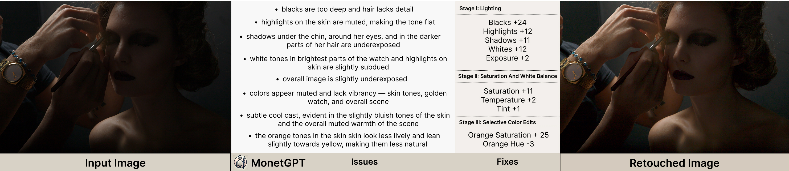

# MonetGPT: Solving Puzzles Enhances MLLMs' Image Retouching Skills
### **SIGGRAPH 2025 (ACM Transactions on Graphics)**

<div align="center">

[](https://monetgpt.github.io/) 
[](https://arxiv.org/abs/2505.06176)
[](https://dl.acm.org/doi/pdf/10.1145/3730926)
[](https://huggingface.co/niladridutt/monetGPT)


</div>

<div align="center">

</div>

## Table of Contents

- [Overview](#overview)
- [Quick Start](#-quick-start)
- [Usage](#-usage)
- [Training Your Own Model](#-training-your-own-model)
- [Image Processing CLI Usage](#-image-processing-cli-usage)
- [Puzzle Types](#-puzzle-types)
- [Configuration](#-configuration)
- [Results & Evaluation](#-results--evaluation)
- [Troubleshooting](#-troubleshooting)
- [Citation](#-citation)
- [License](#-license)

## Overview

**MonetGPT** is a novel framework that teaches multimodal large language models (MLLMs) to perform professional-quality image retouching through procedural operations. Unlike generative editing approaches that can unpredictably alter image content, MonetGPT learns to plan and execute sequences of traditional retouching operations (brightness, contrast, saturation, etc.) that preserve object identity and provide explainable results.

### Visual Puzzles for Operation Awareness

🧩 MLLMs learn retouching operations by solving specially designed visual puzzles that teach operation recognition, parameter understanding, and sequence planning.Unlike black-box generative models, MonetGPT provides clear reasoning for each editing decision and preserves original image content and resolution (e.g., 8K 16-bit).

## 🚀 Quick Start

### Installation

```bash
# Clone the repository
git clone https://github.com/monetgpt/monetgpt.git
cd monetgpt

# Create and activate conda environment
conda create -n monetgpt python=3.11
conda activate monetgpt

# Install dependencies
cd llm 
sh install.sh
```

### GIMP Installation

MonetGPT requires **GIMP 2.10** for about 20% of the image processing operations and the rest are implemented using NumPy. Other versions may not be compatible. We might update the code later on to completely remove the requirement for GIMP.

#### Download GIMP 2.10:
- **macOS**: [Download GIMP 2.10.38 ARM64](https://download.gimp.org/gimp/v2.10/macos/gimp-2.10.38-arm64-1.dmg)
- **Linux**: Install via Flatpak: 
  ```bash
  flatpak install flathub org.gimp.GIMP//2.10
  ```
- **Windows**: [Download from GIMP website](https://download.gimp.org/gimp/v2.10/)

#### Install NumPy for GIMP (Linux Flatpak only):
```bash
flatpak run --command=sh org.gimp.GIMP//stable -c "python -m pip install --user numpy"
```

Note: MacOS version ships with NumPy built-in.

### Download Pre-trained Model

Download the trained MonetGPT model from Hugging Face:

```bash
# Navigate to llm directory and create models folder
cd llm
mkdir -p models
cd models

# Download the model using HF CLI
huggingface-cli download niladridutt/monetGPT

# OR Clone the model repository (requires git lfs)
git clone https://huggingface.co/niladridutt/monetGPT
```

> **Note**: Ensure the model is saved as `llm/models/monetGPT` to match the expected directory structure or otherwise modify the configs in llm.

## � Usage

<div align="center">

</div>

## Inference

First start the LLM, which shall launch a server

```bash
cd llm
sh test.sh
cd ..
```

Run image enhancement/retouching with the pre-trained MonetGPT model (make sure the LLM is running):

```bash
# Single image processing

python inference_cli.py single input.jpg --output results/edited.jpg

# Batch processing
python inference_cli.py batch assets/test --output-dir results/
```

## 📚 Training Your Own Model

### 1. Dataset Preparation

See `image_sources` in `configs/dataset_config.yaml`

```bash
# Prepare your training images
mkdir -p data/ppr10k
# Place your .png/.jpg images in data/images/
```

### 2. Generate Training Puzzles

```bash
# Step 1: Generate puzzle configurations (operation parameters)
python dataset_cli.py generate

# Step 2: Create visual puzzle images
python pipeline_cli.py puzzle 1     # Single operation puzzles
python pipeline_cli.py puzzle 2     # Multi-version comparison puzzles  
python pipeline_cli.py puzzle 3     # Comprehensive editing puzzles
python pipeline_cli.py puzzle all   # Generate all puzzle types
```

### 3. Generate LLM Reasoning

```bash
# Step 3: Query LLM to add reasoning to puzzle configs
python dataset_cli.py query 1 0 -1    # Generate reasoning for all puzzle 1 configs (all)
python dataset_cli.py query 2 0 -1   # Generate reasoning for puzzle 2 configs (all)
python dataset_cli.py query 3 0 -1    # Generate reasoning for puzzle 3 configs (all)

# Step 4: Create final ShareGPT format datasets  
python dataset_cli.py create          # Create datasets for all puzzles

# Step 5: Combine datasets for training
python dataset/combine_jsons.py       # Combine JSON datasets and export for training
```

### 4. Train the Model

```bash
# Train MonetGPT model on the generated datasets
cd llm
sh train.sh
```

> **Note**: This project uses [LLaMA-Factory](https://github.com/hiyouga/LLaMA-Factory) for training infrastructure, which is licensed under [Apache 2.0](https://github.com/hiyouga/LLaMA-Factory/blob/main/LICENSE).

## � Image Processing CLI Usage

### Single Image Edit

```bash
# Apply a specific retouching configuration to an image
python pipeline_cli.py edit configs/example_edit.json input.jpg output.jpg
```

### Batch Processing

```bash
# Process multiple images with MonetGPT predictions
python pipeline_cli.py batch predictions --target-editor a
```

### Generate Puzzle Images

```bash
# Generate single operation puzzles
python pipeline_cli.py puzzle 1

# Generate multi-version comparison puzzles
python pipeline_cli.py puzzle 2

# Generate comprehensive editing puzzles
python pipeline_cli.py puzzle 3

# Generate all puzzle types
python pipeline_cli.py puzzle all
```


## 🧩 Puzzle Types

### Puzzle 1: Single Operation Analysis
- **Purpose**: Teach individual retouching operations
- **Format**: Before/after comparison with single operation
- **Example**: "Which adjustment was applied and how much?"

### Puzzle 2: Multi-Version Comparison  
- **Purpose**: Teach parameter value relationships
- **Format**: Multiple versions with different parameter values
- **Example**: "Rank these images by optimal saturation level"

### Puzzle 3: Comprehensive Editing Plans
- **Purpose**: Teach complete retouching workflows
- **Format**: Multi-step editing sequences
- **Example**: "Plan the editing sequence: 1) Fix lighting 2) Adjust white balance 3) Enhance colors"

## 🔧 Configuration

### Dataset Configuration (`configs/dataset_config.yaml`)

```yaml
# LLM settings for reasoning generation
model: "gemini-2.0-flash"
api_key: ""  # Set your API key here
base_url: "https://generativelanguage.googleapis.com/v1beta/openai/"
timeout: 5
retry_attempts: 1

# Puzzle paths and settings
puzzles:
  puzzle1:
    reasoning_path: "./data/puzzles1/reasoning/*.txt"
    images_path: "./data/puzzles1/images/*.png"
    images_base_path: "./data/puzzles1/images"
    output_file: "data/sharegpt_puzzle_1.json"
  
  puzzle2:
    reasoning_path: "./data/puzzles2/reasoning/*.txt"
    images_path: "./data/puzzles2/images/*.png"
    images_base_path: "./data/puzzles2/images"
    output_file: "data/sharegpt_puzzle_2.json"
    
  puzzle3:
    reasoning_path: "./data/puzzles3/reasoning/*.txt"
    images_path: "./data/puzzles3/images/*/*.tif"
    images_base_path: "./data/puzzles3/images"
    output_file: "data/sharegpt_puzzle_3.json"

# Generation settings
generation:
  num_standard_trials: 2
  num_color_trials: 1
  num_puzzle3_trials: 10
```

### Pipeline Configuration (`configs/pipeline_config.yaml`)

```yaml
# GIMP settings
gimp:
  paths:
    macos: "/Applications/GIMP.app/Contents/MacOS/gimp-console-2.10"
    linux: "flatpak run org.gimp.GIMP//stable --no-interface"
    windows: "gimp-console-2.10.exe" (Not tested, may require some modifications)
  
  batch_interpreter: "python-fu-eval"
  python_warnings: "ignore"
  pipeline_file: "./gimp_pipeline.py"

# Image processing settings
image_processing:
  max_low_res_size: 700  # Low resolution for MLLM training only
  default_dpi: 140       # Original resolution is preserved during inference

# Processing parameters
processing:
  batch_size: 10
  max_workers: 4
  timeout_seconds: 120
```

### Benchmark Performance
MonetGPT achieves state-of-the-art results on image retouching tasks while providing full explainability and maintaining original image resolution.

## 🔧 Troubleshooting

### Common Issues

**GIMP Not Found**: Ensure GIMP 2.10 is installed and the path in `configs/pipeline_config.yaml` matches your installation.

**NumPy Import Error**: Install NumPy in GIMP's Python environment (see GIMP installation section).

**Model Download Issues**: Verify Git LFS is installed for large model files: `git lfs install`


## 📄 Citation

If you find MonetGPT useful in your research, please consider citing our paper:

```bibtex
@article{dutt2025monetgpt,
  title={MonetGPT: Solving Puzzles Enhances MLLMs' Image Retouching Skills},
  author={Dutt, Niladri Shekhar and Ceylan, Duygu and Mitra, Niloy J},
  journal={ACM Transactions on Graphics (TOG)},
  volume={44},
  number={4},
  pages={1--12},
  year={2025},
  publisher={ACM New York, NY, USA}
}
```


## 📜 License

This project is released under the [MIT License](LICENSE).

This project uses image dehazer as one of the image operations. This code is adapted from [Single-Image-Dehazing-Python](https://github.com/Utkarsh-Deshmukh/Single-Image-Dehazing-Python/tree/master), which is licensed under the BSD 2-Clause License. A copy of this license can be found in the [licenses/BSD-2-Clause.txt](licenses/BSD-2-Clause.txt) file.


